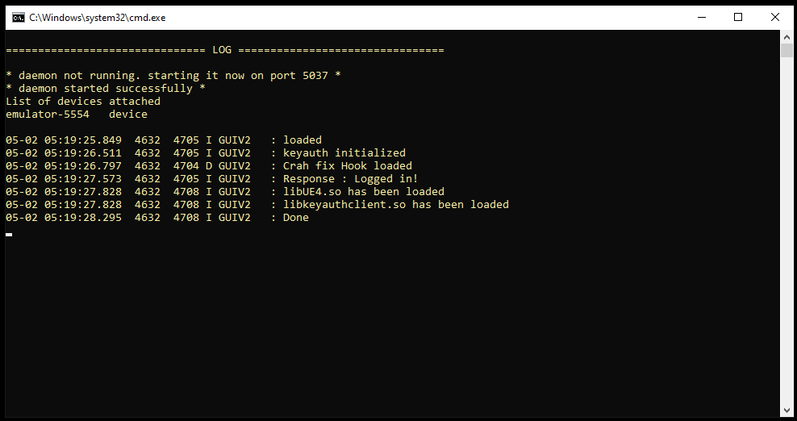

# LibKeyAuthClient

LibKeyAuthClient is a C++ shared library designed to streamline integration with the KeyAuth.cc API. It provides a robust framework for implementing user authentication, updates, and other essential API functionalities directly within C++ shared libraries. This library simplifies the incorporation of advanced security and functionality into your applications, enhancing both performance and usability.

## What is it?

This project loads a shared library called LibKeyAuthClient.so into memory using dlopen, through which we import a suite of KeyAuth API functions. These functions allow us to verify licenses, monitor online sessions, access global variables, gather statistics, and more. We are committed to continuously expanding the library's capabilities. Make sure to follow this repository to stay updated with new features and enhancements!

## NEW RELEASE

- [ 1.1 ](https://github.com/ExploitTheLoop/LibKeyAuth/releases/tag/libkeyauth)

## ARCHITECTURAL SUPPORT
- armeabi-v7a
- arm64-v8a

## Features

**Current Capabilities:**
- **Initialization and Authentication:** Demonstrations are provided on how to initialize the API and authenticate using a license.

**Upcoming Enhancements:**
- **Session Check:** Ensures application stability by checking session validity and preventing crashes when a key ends or a session expires. ✔️
- **Manual Update:** Allows users to manually update their session or application as needed. ✔️
- **Forced Update:** Implements automatic updates to ensure users are always running the latest version of the application. ✔️
- **Real-Time Notifications:** Enables sending notifications to selected users or broadcasting to all users, enhancing communication and user engagement. ✔️
- **Version Check:** Verifies that users are running the most current version of the application, prompting updates where necessary. ✔️
- **Real-Time Data via Webhook:** Provides the ability to fetch and process real-time data through webhooks, facilitating more dynamic interactions and data handling. ✔️

## Demonstration

Below are detailed demonstrations showcasing the current functionalities of `LibKeyAuthClient`:

**Initialization and Login with License:**
This demonstration shows how to properly initialize the API and authenticate a user by verifying their license key. This process is crucial for securing access and ensuring that only licensed users can utilize your application.


## USE THE CODES INTO YOUR C++ SHARED LIBRRARY PROJECT 

- [ source That you can use to build ](https://github.com/LGLTeam/Android-Mod-Menu)
## DO NOT ALTER THE NAME OF LIB ELSE WONT WORK


To Read License from text file :

```bash
std::string  ReadLisence(){
    std::ifstream file("/storage/emulated/0/Android/data/"+app_package_name+"/.userkey");
    std::string str;
    std::string file_contents;
    while (std::getline(file, str))
    {
        file_contents += str;
        // file_contents.push_back('\n');
    }
    return file_contents;

}
```

Required Functions:

```bash
std::string extractJsonStringValue(const std::string& jsonString, const std::string& key) {
    std::size_t keyPos = jsonString.find("\"" + key + "\"");
    if (keyPos == std::string::npos)
        return "key value not found";

    std::size_t valueStart = jsonString.find(':', keyPos);
    if (valueStart == std::string::npos)
        return "key pos error";
    valueStart++;

    std::size_t valueEnd = jsonString.find_first_of(",}", valueStart);
    if (valueEnd == std::string::npos)
        return "end position error";


    return jsonString.substr(valueStart, valueEnd - valueStart);
}

std::string removeDoubleQuotes(const std::string& input) {
    std::string result;
    for (char c : input) {
        if (c != '"') {
            result += c;
        }
    }
    return result;
}

```
API Function declaration:

```bash

int (*isKeyauthInitorg)(std::string name, std::string ownerid, std::string apiurl);
std::string (*KeyauthLicense)(std::string key, std::string hwid);
std::string (*KeyauthFetchonline)();
std::string (*KeyuathFetchStats)();
std::string (*KeyauthGetVar)(std::string variable); //doesnt need removedoubleqoutes
std::string (*SendDataToDiscord)(std::string jsonData, std::string url);

```

Thread to execute:
```bash
void *test_thread(void *) {

    // Load the shared library
    void* handle = dlopen("libkeyauthclient.so", RTLD_LAZY);
    if (!handle) {
        LOGI("Cannot open library: %s", dlerror());
        return 0;
    }
    LOGI("loaded");
    // Reset errors
    dlerror();

#if defined(__aarch64__) //To compile this code for arm64 lib only. Do not worry about greyed out highlighting code, it

    isKeyauthInitorg = (int (*)(std::string, std::string, std::string)) getAbsoluteAddress("libkeyauthclient.so", 0x15AA4C);
    KeyauthLicense = (std::string (*)(std::string, std::string)) getAbsoluteAddress("libkeyauthclient.so", 0x15AA64);
    KeyauthFetchonline = (std::string (*)()) getAbsoluteAddress("libkeyauthclient.so", 0x15AAA8);
    KeyuathFetchStats = (std::string (*)()) getAbsoluteAddress("libkeyauthclient.so", 0x15AAB4);
    KeyauthGetVar = (std::string (*)(std::string)) getAbsoluteAddress("libkeyauthclient.so", 0x15AAC0);
    SendDataToDiscord = (std::string (*)(std::string,std::string)) getAbsoluteAddress("libkeyauthclient.so", 0x15AAD0);

#else
    isKeyauthInitorg = (int (*)(std::string, std::string, std::string)) getAbsoluteAddress("libkeyauthclient.so", 0xF1420);
    KeyauthLicense = (std::string (*)(std::string, std::string)) getAbsoluteAddress("libkeyauthclient.so", 0xF1438);
    KeyauthFetchonline = (std::string (*)()) getAbsoluteAddress("libkeyauthclient.so", 0xF1478);
    KeyuathFetchStats = (std::string (*)()) getAbsoluteAddress("libkeyauthclient.so", 0xF1494);
    KeyauthGetVar = (std::string (*)(std::string)) getAbsoluteAddress("libkeyauthclient.so", 0xF14B0);
    SendDataToDiscord = (std::string (*)(std::string,std::string)) getAbsoluteAddress("libkeyauthclient.so", 0xF14D0);
#endif
    if(isKeyauthInitorg){
        bool isexecuted = isKeyauthInitorg("yourname","yourownerid","https://keyauth.win/api/1.2/");
        if(isexecuted){
            LOGI("keyauth initialized");

            std::string licenseResult = removeDoubleQuotes(extractJsonStringValue(KeyauthLicense("KEYAUTH-4Y4L0A-hnXmin-fSJnxw-8vvGko-C9wWcZ-WwXLSi",""),"message"));
            LOGI("Response : %s",licenseResult.c_str());

        }

    }else{
        LOGI("COULD NOT FIND THE FUNC");
    }

    // Close the library
   // dlclose(handle);
    return 0;
}
```
Initiate it inside Main Thread :
```bash
pthread_create(&t, 0, test_thread, 0);
```

## OUTPUT


## Prerequisites

- A modern C++ compiler (C++11 or later)
- CMake 3.10 or higher for building the project

Clone this repository and compile the library:

```bash
git clone https://github.com/yourusername/LibKeyAuthClient.git
cd LibKeyAuthClient
mkdir build && cd build
cmake ..
make
sudo make install
```

## Acknowledgements
- [keyauth official website ](https://keyauth.cc/)
- [keyauth github For other source c++ Applications , java , go, etc ](https://keyauth.cc/)

## Contact

- **L. Lawliet** - [Join](https://discord.gg/fMwvMGaUup)
- Project Link: [https://github.com/yourusername/LibKeyAuthClient](https://github.com/yourusername/LibKeyAuthClient "Visit LibKeyAuthClient on GitHub")


